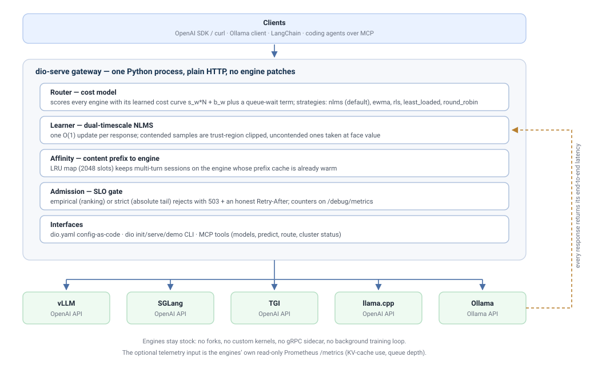

<p align="center">
  
</p>

<h1 align="center">DIO — a non-invasive control plane for multi-instance LLM serving</h1>

<p align="center">
  <a href="https://github.com/nisaral/DIO/actions/workflows/ci.yml"></a>
  
  
  
  
  <a href="https://doi.org/10.5281/zenodo.22085398"></a>
</p>

<p align="center">
  <strong>Wrap stock vLLM. Learn latency online. Route smart. Admit safely.</strong><br/>
  Research artifact + installable <code>pip</code> gateway &mdash;
  <strong>no engine patches, no forked vLLM, no custom kernels.</strong>
</p>

<p align="center">
  <a href="dio-serve/README.md"><strong>dio-serve package</strong></a> ·
  <a href="dio-serve/docs/ARCHITECTURE.md">Architecture</a> ·
  <a href="dio-serve/docs/API.md">API docs</a> ·
  <a href="dio-serve/scripts/">Reproduce the paper</a>
</p>

---

**`dio-serve`** is a thin OpenAI-compatible gateway that load-balances across several
**stock vLLM** replicas. No engine patches, no forked vLLM, no custom kernels — it
speaks the HTTP API and reads the Prometheus `/metrics` your engines already expose.

It exists because the usual answer, N vLLM processes behind Nginx or Envoy with
Round-Robin, treats every replica as interchangeable while queue depth, KV-cache
pressure, and transient per-replica slowdowns diverge in practice.

> **Paper:** *DIO: Hybrid Cost Routing, Session Affinity, and Calibration-Robust Admission for
> Multi-Instance LLM Serving over Stock vLLM* — revised for a practice-oriented
> journal submission. Artifact DOI: https://doi.org/10.5281/zenodo.22085398

<p align="center">
  
</p>

---

## Why not just Nginx round-robin?

Because your replicas are not interchangeable. Round-robin assumes every backend
has the same queue depth and the same free KV cache; on a real fleet that stops
being true the moment one GPU picks up a co-tenant, hits a thermal limit, or gets
handed a long context. DIO makes a different bet:

| | Nginx / Envoy round-robin | DIO |
|---|---|---|
| Backend choice | next in the ring | minimum predicted joint cost |
| Predicts | nothing | per-engine `ŷ_w = s_w·N + b_w`, learned from every response |
| Session affinity | none, or `ip_hash` | content-prefix affinity, so the KV/prefix cache stays warm |
| Overload | unbounded queue → latency cliff | SLO admission: `503` + an honest `Retry-After` |
| Engine telemetry | ignored | optional read-only vLLM `/metrics` fusion |
| Drift | waits for a human | re-learns in O(1) per request, no training step |

It is **not** an edge proxy: DIO speaks the OpenAI and Ollama HTTP APIs and should
sit behind an authenticating reverse proxy in production. It replaces the
*upstream-selection* layer, not Nginx itself.

---

## Try it in 60 seconds (no GPU)

```bash
pip install -e dio-serve     # Python 3.9+
dio demo                     # mock fleet incl. a GPU that gets throttled mid-run
```

Or containerised, in front of a real engine:

```bash
cd dio-serve && docker compose up    # Ollama + DIO on :8085
```

Then point any OpenAI / Ollama client at it:

```bash
curl http://127.0.0.1:8085/v1/chat/completions \
  -H 'Content-Type: application/json' \
  -d '{"model":"default","messages":[{"role":"user","content":"hello"}]}'
# -> X-DIO-Backend: gpu-a   (which engine served it)
```

`/health` reports `degraded` when a backend is out of rotation; `/debug/metrics`
exposes the learned slopes, affinity hit rate and admission counters.

### What it looks like

`dio demo` runs eight agent sessions over three mock engines, throttles one of them
mid-run, then replays the same workload through three routers:

| router | mean ms after the throttle | engine switches / session |
|---|---|---|
| round-robin (Nginx default) | 1994 | 10.9 |
| sticky round-robin (`ip_hash`) | 1453 | 0.0 |
| **DIO** | **1328** | **1.0** |

DIO moves traffic off the engine that degraded while keeping prefix affinity: it
takes most of the stickiness win without pinning half the fleet to a sick
backend. Mock engines, so this is a behaviour demo rather than a hardware
benchmark - full output in
[`docs/launch/evidence/swarm-demo-postfix.txt`](docs/launch/evidence/swarm-demo-postfix.txt).

---

## Start here (v0.4.2)

```bash
git clone https://github.com/nisaral/DIO.git
cd DIO/dio-serve
pip install -e .

# 1. Auto-discover local engines (Ollama, vLLM, SGLang) & create dio.yaml:
dio init

# 2. Start the gateway:
dio serve

# Or run zero-GPU instant demo:
dio demo
```

- Point **OpenAI SDK / LangChain** at `http://localhost:8085/v1`
- Point **Ollama CLI / OpenWebUI** at `http://localhost:8085/api` (or `OLLAMA_HOST=http://localhost:8085`)
- Connect **Cursor / Claude Desktop / VS Code** via MCP: `dio mcp`

Full docs → **[dio-serve/README.md](dio-serve/README.md)** ·
Config-as-Code → **[dio.example.yaml](dio.example.yaml)** ·
Architecture → **[docs/ARCHITECTURE.md](dio-serve/docs/ARCHITECTURE.md)** ·
API → **[docs/API.md](dio-serve/docs/API.md)**

---

## Architecture

```text
 Clients (OpenAI SDK / curl / LangChain)
                 │
                 ▼
        ┌────────────────┐
        │  DIO Gateway   │  dual-timescale NLMS
        │  :8085 /v1/*   │  joint cost · affinity · admission
        └───────┬────────┘
           HTTP OpenAI API + /metrics scrape (engines unmodified)
        ┌───────┴────────┬────────────┐
        ▼                ▼            ▼
   vLLM GPU0        vLLM GPU1     SGLang / TGI / Ollama
```

DIO **does not** own kernels, KV caches, or continuous batching. Those stay in vLLM.
DIO owns **placement, learning, and admission** — add GPUs by adding URLs.

---

## What it does

**Hybrid cost routing.** Each backend is scored
`S_w = wait_w + ŷ_w + tierCost + vramCost + c_kv·KV_w + c_q·W_w − cacheBonus_w − c_p·Hit_w`.
The latency term `ŷ_w = s_w·N + b_w` comes from a **dual-timescale NLMS** filter
(`s_eff = α·s_fast + (1−α)·s_slow`) that tracks fast shifts without letting noise
destabilize the slow estimate. O(1) per update, no training step.

**Engine-metric fusion.** Scrapes each vLLM's `/metrics` for KV-cache utilization,
waiting-request count, and prefix-hit rate. Read-only.

**Session and prefix affinity.** Multi-turn conversations stay on the replica already
holding their shared prefix, so the KV cache is reused rather than rebuilt. Hit rate
and stickiness are exported, not assumed.

**Admission decoupled from absolute prediction.** Three modes — `rank_only`,
`empirical` (default), `absolute` (diagnostic only; see below).

---

## The main finding is a negative one

A tempting design is to learn one latency model and use it for two jobs: ranking
replicas, and gating admission against an SLO. **The second job does not hold.**

At MAPE ≈ 90–130%, the textbook policy *"reject if min ŷ > SLO"* rejects **~40% of a
load that rank-relative and empirical gating complete in full**. A model accurate
enough to *order* replicas can be far too coarse to *threshold* on.

That is why `absolute` mode ships as a **diagnostic** and the default is `empirical`
(rolling observed percentile). Keeping ranking and admission as separate policies is a
correctness requirement for any predictive gateway built on black-box telemetry, not
an implementation detail.

---

## Measured results

Dual Tesla T4, Qwen2.5-3B-Instruct, two stock vLLM replicas, n=10 seeds.

| Scenario | Result |
|---|---|
| Matched backends | Near Round-Robin parity — no manufactured win |
| Controlled ×2 service-time asymmetry | **p99 −48.3% ± 0.7%** vs RR; beats d=2 RLS |
| Real multi-turn | p99 improves on **8/10 seeds** (median 51.8%, Wilcoxon p ≈ 0.01) |
| Session stickiness | 1.00 vs RR 0.50; **0.998 vs 0.75** under concurrent load |
| Admission, tight SLO | `empirical`/`rank_only` complete all; `absolute` rejects ~40% |

**A caveat we state up front.** In the multi-turn suite the two NLMS arms differ in
*two* knobs at once (engine-metric fusion **and** the affinity cache bonus), so that
margin is a **joint** effect. A decomposition over 100 live snapshots puts the
affinity bonus **194× above** the scraped gauge terms on this hardware, so the gain
belongs to affinity, not the gauges — the reverse of how earlier drafts of our own
work read the same data. Reproduce:
[`scripts/audit_g1_confound.py`](dio-serve/scripts/audit_g1_confound.py).

**Scope.** Two T4s and a 3B model at low concurrency, not an A100/H100 fleet. The
scraped gauge terms contribute little here precisely because queues barely diverge at
that operating point; expect them to matter with deeper concurrency, more replicas, or
heterogeneous peers.

---

## Dogfooding: one gateway, a swarm of agents

The router was exercised the way it will actually be used: several agents holding
their own multi-turn sessions against a **live** gateway
(`examples/swarm_live_stack.py`), over OpenAI JSON, OpenAI SSE and Ollama ndjson at
the same time -- ~700 requests, including 80-way and 300-way bursts.

`examples/agent_swarm_demo.py` replays that workload offline, three ways, while the
fastest engine is throttled 8x part-way through (`--agents 8`):

| router | engine switches / session | mean latency (after the throttle) | session affinity |
|---|---|---|---|
| round-robin (per request, Nginx default) | 10.8 | 1990 ms | -- |
| sticky round-robin (`ip_hash`-style) | 0.0 | 1438 ms | -- |
| **DIO** | **1.2** | **1298 ms** | **86%** |

Raw per-run metrics, the verification tables and the repro commands live in
[`docs/launch/evidence/`](docs/launch/evidence/).

Read that honestly. The whole-run p95/p99 is dominated by whatever was in flight
when the engine degraded, so the *mean* and the *traffic share* are the columns that
carry information; DIO keeps sessions pinned (1.2 switches vs 10.8) and still holds
the best post-throttle mean. It also *keeps* sending some work to a degraded engine
when the affinity bonus outweighs the latency gap -- a deliberate trade, because a
warm prefix cache is worth real milliseconds, not a bug. The engines are local
behaviour mocks, so none of this is a hardware performance claim.

Using it for real is also how most of the bugs in
[`CHANGELOG.md`](CHANGELOG.md#unreleased---production-hardening) were found, e.g.:

- streaming requests were sent to token-gated engines **without the engine's API
  key**, so every stream 401'd while the JSON path worked;
- failed requests were counted as successes, so `goodput_fraction` reported `1.00`
  on a run where half the requests failed;
- `POST /debug/backends` accepted any `base_url`, which made the admin plane an
  **SSRF primitive** (`http://169.254.169.254/...` now returns 400);
- `max_tokens: 10**9` was forwarded unbounded and held an engine until the client
  gave up, while negative `max_tokens` and empty `messages` were accepted.

A second round -- four agents on one live gateway, ~1000 requests over OpenAI JSON,
OpenAI SSE, Ollama ndjson, plus 80/200/500-way storms -- found the rest:

- Ollama streaming reported *estimated* token counts while the JSON path reported the
  engine's, so the same prompt produced two different answers depending on `stream`;
  the gateway now requests `stream_options.include_usage` (and retries once without it
  for engines that reject the field);
- one absurd `max_tokens` made the learned prediction ~10^9 ms and left a permanent
  crater in `mae`/`mape`; the routing feature is now clamped (`token_feature_cap`),
  never the forwarded request;
- streamed **tool calls were dropped** and `done_reason` was hardcoded to `stop`;
- an unknown `model` returned 200 and was served anyway -- now 404 `model_not_found`;
- unparseable JSON returned a framework **422** -- now OpenAI's 400 envelope;
- in a 500-wide storm at p95 ~29 s against a 5 s budget, **nothing** ever told the
  client it was over budget (no 503, no header). Every response now carries
  `X-DIO-Budget-Ms` / `X-DIO-Over-Budget` (and `X-DIO-Predicted-Ms` on streams).

---

## Reproducing the paper

All in [`dio-serve/scripts/`](dio-serve/scripts/):

| Script | Produces |
|---|---|
| `run_gpu_abc_suite.py` | G1–G3 dual-T4 suites (hybrid, affinity, admission) |
| `audit_g1_confound.py` | The 194× decomposition behind the caveat above |
| `run_rls_headtohead.py` | NLMS vs d=2 recursive least squares |
| `run_real_hetero_multiseed.py` | Controlled service-time asymmetry (Regime C) |
| `run_g1_factorial_mock.py` | 2×2 factorial on mock engines, no GPU required |
| `run_abc_experiments.py` | Coefficient and ablation checks |

Runbooks: [`scripts/GPU_ABC_RUNBOOK.md`](dio-serve/scripts/GPU_ABC_RUNBOOK.md) and
[`scripts/GPU_CLUSTER_RUNBOOK.md`](dio-serve/scripts/GPU_CLUSTER_RUNBOOK.md).
Raw multi-seed outputs are committed under `dio-serve/results_*/`.

---

## Key configuration

Every field is settable by flag or `DIO_`-prefixed env var
([`src/dio/config.py`](dio-serve/src/dio/config.py)); paper defaults shown.

| Setting | Default | Meaning |
|---|---|---|
| `--admission-mode` | `empirical` | `empirical` \| `rank_only` \| `absolute` (diagnostic) |
| `--cache-bonus-ms` | `200` | Session/prefix affinity bonus |
| `--slo-ms` | `5000` | Admission budget |
| `engine_metrics` | `true` | Scrape vLLM `/metrics` |
| `kv_cache_cost_ms` | `800` | `c_kv`, × KV utilization |
| `engine_queue_cost_ms` | `50` | `c_q`, × waiting requests |
| `engine_prefix_hit_bonus_ms` | `150` | `c_p`, × prefix-hit rate |

Live introspection while running: `/debug/predictions`, `/debug/affinity`,
`/debug/admission`, `/debug/engine`, `/debug/workers`.

---

## Repository layout

This repo holds **two separate systems**. The paper is about `dio-serve/` only.

| Path | What it is |
|------|-----------|
| **[`dio-serve/`](dio-serve/)** | **The paper's system.** Python/FastAPI gateway over stock vLLM. Start here. |
| [`DIO/`](DIO/) | Earlier, unrelated prototype: Go control plane, BoltDB, gRPC to a Python data plane. Not used for any result in the paper. |
| [`paper_drafts_latex/`](paper_drafts_latex/) | Manuscript sources (Springer submission). |
| [`figs/`](figs/) | Paper figures. |

---

## Citation

Cite the paper, not the software, once the preprint is announced:

```bibtex
@misc{dio2026,
  title  = {DIO: Hybrid Cost Routing, Session Affinity, and Calibration-Robust Admission
            for Multi-Instance LLM Serving over Stock vLLM},
  author = {Nisar, Keyush and Parikh, Krishil and Maisheri, Krisha and
            Gawade, Aruna and Rathod, Nilesh T. and Florence A, Angelin},
  year   = {2026},
  doi    = {10.5281/zenodo.22085398},
  url    = {https://github.com/nisaral/DIO},
  note   = {Software and experimental artifact release}
}
```

## Get involved

- ⭐ **Star this repo** if a predictive, non-invasive gateway is useful to you — it is
  how the next person running a vLLM/Ollama fleet finds it.
- 🐛 **Bug reports** with a reproduction go straight into the regression suite:
  [Issues](https://github.com/nisaral/DIO/issues).
- 🔧 **Contributing:** start with [`CONTRIBUTING.md`](CONTRIBUTING.md).
- 💬 **Design questions:** [Discussions](https://github.com/nisaral/DIO/discussions).

---

## License

Apache-2.0 — see [`dio-serve/LICENSE`](dio-serve/LICENSE).
