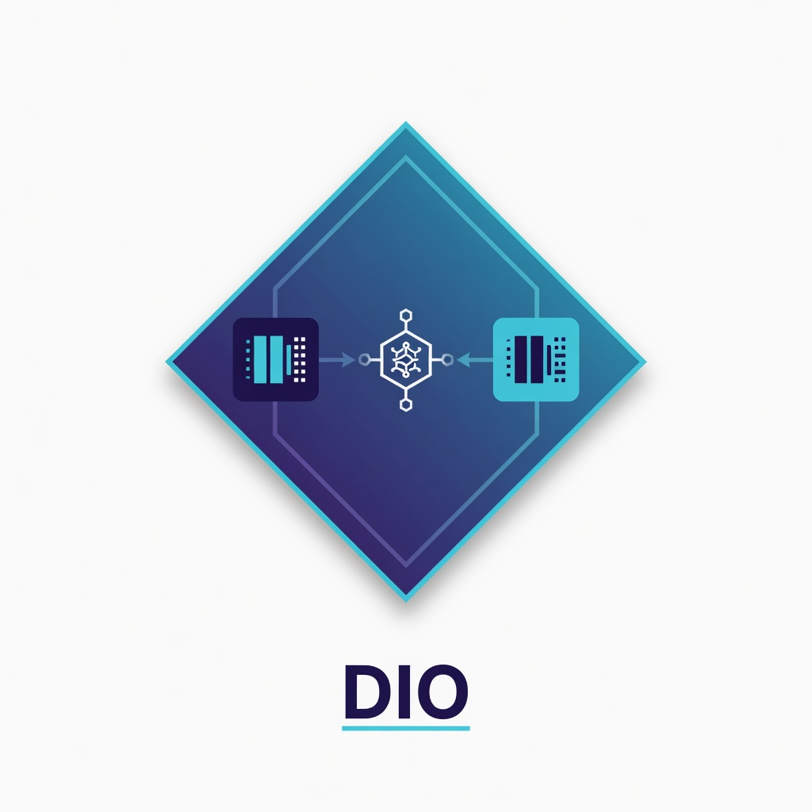

<p align="center">
  
</p>

<h1 align="center">DIO Serve</h1>

<p align="center">
  <strong>Predictive NLMS orchestrator that wraps vLLM — not a fork.</strong><br/>
  Scalable · OpenAI-compatible · <code>pip install</code> · zero engine patches
</p>

<p align="center">
  <a href="docs/PERFORMANCE.md">Performance guide</a> ·
  <a href="docs/ARCHITECTURE.md">Architecture</a> ·
  <a href="docs/API.md">API Reference</a> ·
  <a href="#quick-start">Quick Start</a>
</p>

---

## What is DIO?

**DIO (Distributed Inference Orchestrator)** is a **control-plane gateway** that sits in front of one or more already-running LLM engines (vLLM, SGLang, TGI, Ollama, …) and:

1. **Learns** each backend’s latency online (dual-timescale NLMS)  
2. **Routes** with a joint cost (latency + queue + tier + VRAM + cache)  
3. **Admits or rejects** under overload (`min cost ≤ SLO`) so goodput stays high  

Clients use a normal **OpenAI `base_url`**. Engines stay stock.

```text
  App / OpenAI SDK / LangChain
              │
              ▼
     ┌─────────────────┐
     │  DIO  :8085/v1  │  ← you install this
     └────────┬────────┘
        ┌─────┴─────┐
        ▼           ▼
   vLLM :8000  vLLM :8001   ← you already run these
```

Full design: **[docs/ARCHITECTURE.md](docs/ARCHITECTURE.md)**  
Every public class/method: **[docs/API.md](docs/API.md)**

---

## Why DIO?

| | Round-robin / nginx | Engine forks | **DIO wrap** |
|--|---------------------|--------------|--------------|
| Heterogeneous GPUs | Blind | Custom | **Learned ms/token** |
| VRAM / OOM | After crash | Engine-specific | **Soft + hard admission** |
| Overload | Unbounded queue | Varies | **503 when min S_w > SLO** |
| Upgrade vLLM | Easy | Hard | **Easy** |
| Install | Config | Rebuild | **`pip install`** |

### Novel (research) pieces

1. **Dual-timescale NLMS** — fast µ for jitter, slow µ for thermal/drift, \(O(1)\) updates  
2. **Admission as goodput optimizer** — formal reject rule under SLO  
3. **Joint cost** — one score for multi-model + memory + latency  
4. **Non-invasive** — HTTP wrap only (no vLLM patches)

---

## Install

```bash
git clone https://github.com/nisaral/DIO.git
cd DIO/dio-serve
pip install -e .

# optional
pip install -e ".[dev,bench]"
```

Smoke (no GPU):

```bash
dio version
dio demo --duration 15
dio bench-smoke -n 40
```

---

## Quick start

### A) Zero GPU

```bash
dio demo --port 8085 --duration 20
```

### B) Wrap two vLLM processes

```bash
# terminals 1–2: engines
CUDA_VISIBLE_DEVICES=0 python -m vllm.entrypoints.openai.api_server \
  --model meta-llama/Llama-3.2-3B-Instruct --port 8000
CUDA_VISIBLE_DEVICES=1 python -m vllm.entrypoints.openai.api_server \
  --model meta-llama/Llama-3.2-3B-Instruct --port 8001

# terminal 3: DIO
dio serve \
  -b gpu0=http://127.0.0.1:8000 \
  -b gpu1=http://127.0.0.1:8001 \
  --strategy nlms --nlms-mode dual \
  --slo-ms 60000 --port 8085
```

Helper script: [`examples/wrap_two_vllm.sh`](examples/wrap_two_vllm.sh)

### C) Client

```python
from openai import OpenAI

client = OpenAI(base_url="http://127.0.0.1:8085/v1", api_key="unused")
print(client.chat.completions.create(
    model="meta-llama/Llama-3.2-3B-Instruct",
    messages=[{"role": "user", "content": "Hello from DIO"}],
))
```

```bash
curl http://127.0.0.1:8085/v1/chat/completions \
  -H "Content-Type: application/json" \
  -d '{"model":"m","messages":[{"role":"user","content":"hi"}],"max_tokens":32}'
```

---

## Library usage

```python
from dio import DIOGateway, Backend, Scheduler

# Full gateway (recommended)
gw = DIOGateway(
    backends=[
        Backend(id="gpu0", base_url="http://127.0.0.1:8000", tier="small"),
        Backend(id="gpu1", base_url="http://127.0.0.1:8001", tier="large"),
    ],
    strategy="nlms",
    nlms_mode="dual",
    slo_ms=30_000,
    admission_off=False,
    port=8085,
)
gw.run()

# Or scheduler alone (tests / custom servers)
sched = Scheduler(strategy="nlms", dual=True, admission_off=True, slo_ms=1e9)
sched.register("w0")
wid, decision = sched.pick("hello", tokens=8)
sched.feedback(wid, e2e_ms=120.0, tokens=8)
print(sched.metrics())
```

See **[docs/API.md](docs/API.md)** for every method on `Backend`, `Scheduler`, `DIOGateway`, CLI, and HTTP routes.

---

## How it works (scalable wrap)

```text
1. Client → DIO /v1/*
2. Estimate tokens N
3. Score each backend:  S_w = wait + ŷ_NLMS(N) + tier + vram − cache
4. If min S_w > SLO → 503 (admission)
5. Else HTTP-forward to chosen vLLM (or other engine)
6. Measure latency → NLMS update (O(1)) → free pending slot
```

**Scale out** by adding backend URLs (more GPUs/nodes).  
**Scale the gateway** with one process per region/model shard (shared-nothing learners).

Details & deployment patterns: **[docs/ARCHITECTURE.md](docs/ARCHITECTURE.md)**

---

## Strategies & ablations

| Flag | Meaning |
|------|---------|
| `--strategy nlms` | Default predictive router |
| `--strategy rls` | 2×2 RLS baseline |
| `--strategy static` | Frozen offline slopes |
| `--strategy round_robin` | Classic RR |
| `--strategy least_loaded` | Min in-flight |
| `--nlms-mode dual\|single` | Dual-timescale claim |
| `--ablation no_queue\|no_vram\|no_tier\|no_cache\|no_dual` | Paper ablations |
| `--slo-ms` / `--admission-off` | Admission control |

Env prefix: `DIO_` (e.g. `DIO_STRATEGY=nlms`, `DIO_SLO_MS=5000`).

---

## Observability

| Endpoint | Purpose |
|----------|---------|
| `GET /healthz` | Liveness |
| `GET /debug/workers` | Backends + learned slopes |
| `GET /debug/metrics` | Decisions, MAPE, admission |
| `GET /debug/admission` | Goodput / rejects |
| `GET /debug/predictions` | Dual-vs-single traces |
| `POST /debug/backends` | Hot-register a backend |
| `POST /debug/chaos/vram` | Inject free VRAM |

```bash
curl -s localhost:8085/debug/metrics | jq '.admission, .prediction.mape_pct'
```

---

## Project layout

```text
dio-serve/
  README.md                 # this file
  docs/
    ARCHITECTURE.md         # system design & scalability
    API.md                  # full method/function reference
    assets/logo.jpg
  src/dio/
    scheduler.py            # NLMS + cost + admission
    gateway.py              # FastAPI OpenAI proxy
    backends.py             # Backend pool + mocks
    cli.py                  # dio serve | demo | bench-smoke
    config.py
  examples/
  tests/
```

Sibling (optional systems path): `../DIO/` Go control plane + camera-ready Locust suite.

---


## Production vs mock

| Mode | What runs | Use |
|------|-----------|-----|
| **Production** | Real vLLM/SGLang/TGI/Ollama URLs | `dio serve -b http://gpu:8000 ...` or `examples/production_vllm.py` |
| **Paper / CI** | Library sim + optional mock HTTP | `scripts/run_paper_experiments.py` |

Mocks are **only** for demos/CI. Production never needs them. See [docs/PRODUCTION.md](docs/PRODUCTION.md).

**Why OpenAI-shaped API?** Self-hosted engines (vLLM, SGLang, Ollama, TGI OpenAI mode) all speak OpenAI HTTP — that covers **Llama, Mistral, Qwen, …**, not “only GPT”. TGI native `/generate` is also supported via `api_style="tgi_generate"`.

## Paper experiments (one script, library methods)

```bash
pip install -e .
# algorithmic suite (anywhere, no GPU)
python scripts/run_paper_experiments.py --quick
python scripts/run_paper_experiments.py

# optional: real engines after vLLM is up
python scripts/run_paper_experiments.py --real-backends http://127.0.0.1:8000,http://127.0.0.1:8001
```

Results → `results_paper/` (or `--out`). Also: `scripts/run_publishable_suite.py`.
## Documentation index

| Doc | Contents |
|-----|----------|
| [ARCHITECTURE.md](docs/ARCHITECTURE.md) | Layers, request path, NLMS math, scale-out, K8s patterns |
| [API.md](docs/API.md) | All classes, methods, CLI flags, HTTP routes |
| [examples/library_api.py](examples/library_api.py) | Minimal Python embed |
| [examples/wrap_two_vllm.sh](examples/wrap_two_vllm.sh) | Two-GPU shell |

---

## Citation

```bibtex
@software{dio2026,
  title  = {DIO: Predictive Orchestration for Heterogeneous LLM Inference},
  author = {Nisar, Keyush and Parikh, Krishil and Maisheri, Krisha},
  year   = {2026},
  url    = {https://github.com/nisaral/DIO}
}
```

## License

Apache-2.0
